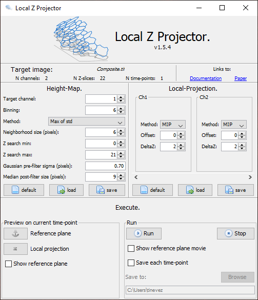

# Local Z projector.

Local Z Projector is an ImageJ2 plugin to perform local-Z projection of a 3D stack, possibly over time, possibly very large.

## Installation.

LocalZProjector is a [Fiji](https://fiji.sc/) plugin and can be installed directly within the [Fiji updater](https://imagej.net/ImageJ_Updater).

In the `Manage update sites` window, check the `Local Z Projector` plugin. Click the `Close` button, then the `Apply changes` button. After the plugin is downloaded, restart Fiji. The plugin can then be launched from the _Plugins > Process > Local Z Projector_ menu item.

## Aims.

LZP performs projection of a surface of interest on a 2D plane from a 3D image. It is a simple tool that focuses on **usability** and is designed to be **adaptable** to many different use cases and image quality. 

- It can work with 3D movies over time with multiple channels. 
- It can work with images much larger than available RAM out of the box. 
- It takes advantage of computers with multiple cores, and can be used in scripts.  

The local Z projection is based on first extracting a reference surface that maps the epithelial layer. The reference surface is represented by the **height-map**, made of one 2D plane per each time-point of the source image, that specifies for every (X, Y) position the Z position of the epithelial layer.  It is determined by applying a 2D filter on each plane of the 3D source image, chosen and configured to yield a strong response for the layer of interest. To speed-up computation and temper the effect of pixel noise, each 2D plane is first binned and filtered with a Gaussian. The height-map is then regularized using a median filter with a large window and rescaled to the original width and height. 

The height-map is then used to extract a projection from the 3D image. A fixed offset can be specified separately for each channel, and is used to collect intensity in planes above or below the reference surface.  Several planes, specified by a ∆z parameter, can be accumulated to generate a better projection, averaging the pixel values or taking the maximum value of these planes.

## Example datasets.

Here are two examples available on Zenodo and that can be used to test the LocalZProjector plugin. 
Both are of images of Drosophila pupa notum, captured on a confocal microscope by Léo Valon.

## Dataset 1.

This dataset  also contains the parameters to generate the reference surface and local projection, also included. The two `*.localzprojector` files can be loaded directly in the plugin to load adequate parameters.
This is a __downsampled__ version of the dataset used to generate the figures 1, 2 and 3 in this paper, as well as the comparison in table 1. Because we downsampled it, the parameters and final image quality won't be identical that of the paper.

## Dataset 2.

A much larger image, also of Drosophila pupa notum. Example parameters are also included.

## Example.

Input: a 3D stack, 2 channels, with an epithelium that resembles a smooth manifold in the green channel. The same channel is corrupted by dead cells for large values of Z, and by an auto-fluorescent cuticle for lower Z. The red channel contains cells, some of which are expressing a fluorescent reporter. It stains their nuclei, just below the epithelium.

The Local Z Projector can generate a local 2D projection, from a few slices around a reference surface that follows the epithelium: 

It can also output the detected reference surface, in the shape of a height-map image that stores as pixel value, the Z plane of the reference surface in the source 3D image.

## Getting the plugin.

The plugin is available via Fiji and can be downloaded using the Fiji updater.
To do so, you simply need to subscribe to the `LocalZProjector` update site on the common server:

## Usage.

After installation, the plugin is located in the `Plugins > Process` menu of Fiji.

Its UI is a made of a simple panel:

### The `Target image` panel.

It just recapitulates properties of the image that will be used as source for the projection. Click on `refresh` when you want to change the source image.

### The `Reference surface` panel.

This panel sets the parameters used to detect the reference surface. 

#### Target channel.

This parameter sets in what channel is the structure to be used for reference surface detection. The index is 1-based (1 stands for the first channel).

#### Binning

Binning sets by how much the target channel is going to be binned. High values result in massive speedup.

A good starting points is to take the largest value that does not completely alter the global structure of the image you want to project. 

#### Method

Determines what filter to use for reference surface detection. Right now there are four methods:

##### Max of mean.

The best Z position is determined by looking for the maximum intensity along a Z column averaged in a NxN window of size given by the `Neighbourhood size` parameter.

##### Max of std

It works in the same way but uses  a standard deviation filter instead of a mean filter. 

It is suited to detect structure with ridges and strong edges, such as epithelia stained for their membrane (example pictured above). Because it is sensitive to contrast, it offers decent robustness against spurious structure with homogenous staining.

##### Sparse max of mean

It works as the `Max of mean` except that the values are not calculated for all the pixels of a slice, but only on a sparse grid spaced by N/2 where N is given by the `Neighbourhood size` parameter. In between the grid corners, the height-map values are obtained *via* linear interpolation.

##### Sparse max of std

The same, but with a standard deviation filter.

#### Neighbourhood size

Sets the size of the filter configured by the `Method` parameter. The size is specified in pixels, regardless of the binning value. 

To start with, take values a bit larger than the structure you want to detect. For instance if you are using the `Max of std` method on an epithelium, starts with a size equal to 2 or 3 times the thickness of a membrane.

#### Z search min & max

Specifies values in case you want to restrict the search excluding some planes at the bottom or at the top of the stack. 

#### Gaussian pre-filter sigma

Sets the standard deviation of the smoothing Gaussian filter to use before filtering. Only use non-zero values if your image is very noisy and you must use low values of the `Binning` parameter.

#### Median post-filter size.

The size of the median filter used to regularise the height-map.

Its size is specified in pixels. Because the median is applied on the binned image, the size needs to take the `Binning` parameter into account. For instance if the `Binning` is 4 and you need a median size of 100, just enter a value of 20.

Because of spurious structures that might appear far from the reference surface, the height-map can be locally aberrant. We use a median filter to correct for this. Use large values if you see that the resulting height-map is not smooth. 

#### The load and save buttons.

The parameters you enter can be saved to a binary file and retrieved later with these two buttons.

### The `Extract projection` panel.

This panel configures how the projection is extracted once we have the reference surface. It is made a list of box, one for each channel in the source image. Each box specifies three parameters, separately for each channel, that specifies how to generate the projection for a channel.

After we have generated the reference surface, we can build a local projection from a smaller volume that follows this surface. The smaller volume is a layer that follows the reference surface, and of thickness given by the `DeltaZ` parameter.

#### Method.

This parameter specifies how to project the smaller volume:

- `MIP`: We take the maximum intensity projection.
- `Mean`: the take the mean along Z.
- `Collect `: we don't project on a single size, but instead output the smaller volume. If this method is selected for at leat one channel, all the `Method` values in the other boxes are ignored.

#### Offset.

Specifies by how many slices to offset the reference surface for this channel. For instance if you want to grab the intensities in a layer 8 z-slices above the reference surface, just enter a value of +8.

#### DeltaZ.

Specifies the thickness of the smaller volume around the reference surface. The thickness of this volume is set to be ±∆z around the reference surface so a value of 2 results in incorporating 5 (2+1+2). A value of 0 takes only the reference surface plane.

### The `Execute` panel.

This is where you can run the projection process. 

The `Preview` side on the left runs the process on the current time-point. The right part runs it on the whole movie (if any). In case you have a large file with many time-points, you can choose to save results for individual time-points.

## Related work.

### DeProj.

Check our MATLAB analysis tools called DeProj:

https://gitlab.pasteur.fr/iah-public/DeProj

It takes:

- the results of a segmentation on the projection image;
- the height-map;

and generates accurate morphological measurements of the tissue cells.

### Other projection tools.

There are several other tools to generate this kind of projections:

- Stack Focuser, an ImageJ plugin: https://imagej.nih.gov/ij/plugins/stack-focuser.html
- SurfCut, an Image macro: https://bmcbiol.biomedcentral.com/articles/10.1186/s12915-019-0657-1
- PreMosa, a standalone software: https://academic.oup.com/bioinformatics/article/33/16/2563/3104469
- Extended Depth of Field, an ImageJ plugin: http://bigwww.epfl.ch/demo/edf/
- Min. Cost Z Surface, an ImageJ plugin: https://imagej.net/Minimum_Cost_Z_surface_Projection
- FastSME and SME, MATLAB software for the extraction of smooth-manifold structures: https://openaccess.thecvf.com/content_cvpr_2018_workshops/w44/html/Basu_FastSME_Faster_and_CVPR_2018_paper.html
