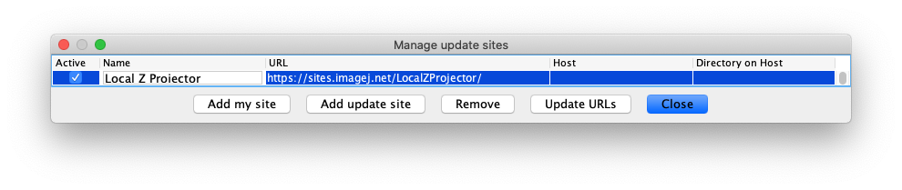

# Local Z projector.

An Ops plugin to perform Local-Z projection of a large stack, possibly over time. 

## Getting the plugin.

The plugin is available via Fiji and can be downloaded using the Fiji updater.
To do so, you simply need to subscribe to the `LocalZProjector` update site on the common server:
